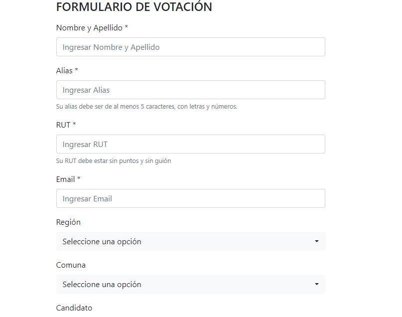
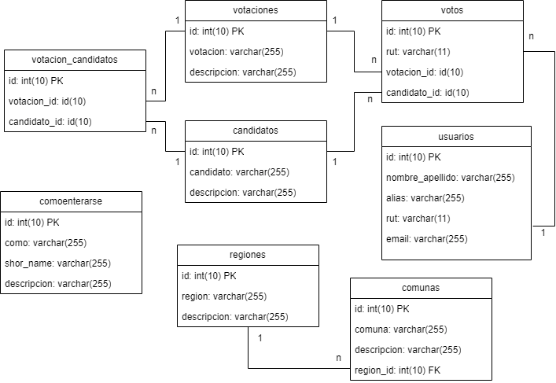

# Dependencias
Se utilizó AppServ para desarrollar la web local: https://www.appserv.org/en/download/

Se trabajó con:
* Apache 2.4.41
* PHP 7.3.10
* MySQL 8.0.17 

# Instalación, levantamiento del servicio y credenciales

## Instalación
Se debe instalar la aplicación descargada desde la página. Se definen parámetros para el servidor web y MySQL según sus necesidades.

## Levantamiento del servicio
Se debe llevar el proyecto a una carpeta que interprete PHP.

## Credenciales
Las credenciales de la base de datos deben ser actualizadas en el archivo `connection.php` ubicado en `back-end/includes/constants.php`, en particular los valores para `$username` y `$password`.

El usuario de la base de datos debe contar con los permisos suficientes para `SELECT`, `UPDATE` e `INSERT`.

# Acceso
Desde el navegador, ir a la ruta donde se alojará el proyecto y dirigirse a la carpeta front-end. Por defecto, el index.php cargará la vista del formulario de votación. Un ejemplo sería `localhost/Desis_prueba/front-end/`

# Modelamiento de la solución

# Consideraciones

* Se asumió que, en caso que el usuario esté creado, se actualizarán los campos de nombre_apellido, alias y email.
* No se almacena la región, comuna ni el cómo se enteró. El motivo es que, dependiendo del uso que se pretenda dar es la manera que se debe almacenar.
* No se realizó ninguna iteración ni retroalimentación, pero se reconoce que es un proceso indispensable en este tipo de situaciones.
* Hay validaciones tanto a nivel de front-end como back-end.